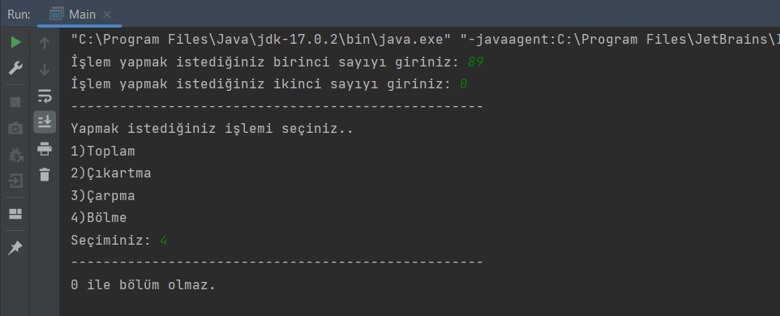

# MERHABA HESAP MAKİNESİ PROGRAMIMA HOŞ GELDİNİZ

* [**Patika.Dev Profil Linkim**](https://app.patika.dev/guleerbilal)

* Bu ödevimde kullanıcıdan alınan sayılara göre kullanıcının seçtiği dört işlem ile kullanılan bir hesap makinesi
yaptım.
* Ek olaraktan seçilen herhangi bir sayı sıfır olursa ve seçilen işlem bölme işlemi olursa bu işlemin yapılamayacağını
da kullanıcıya aktarıyor.

## *Kodlarım*

*

*

*